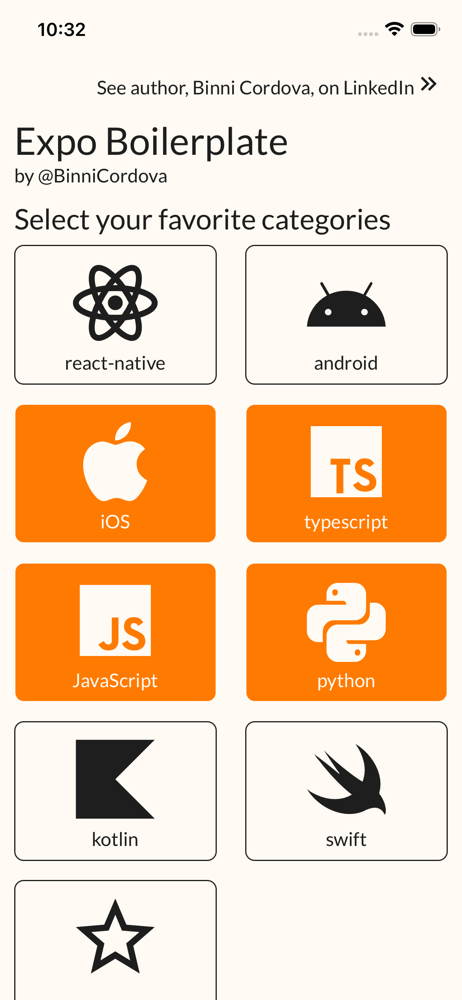
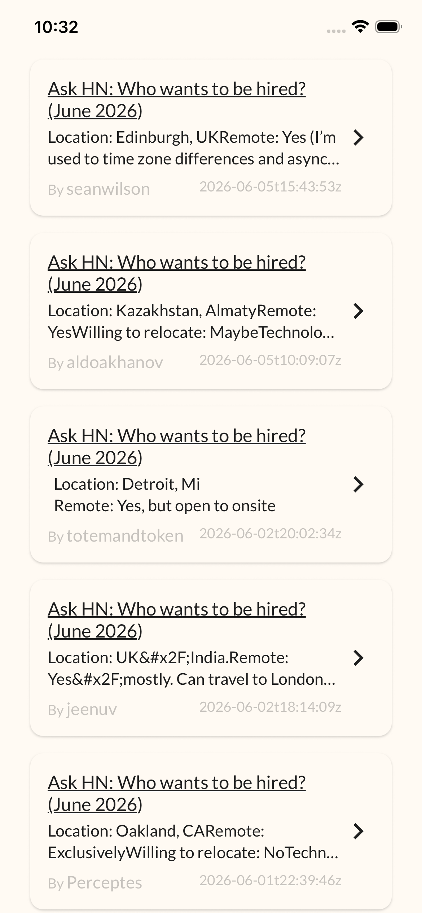
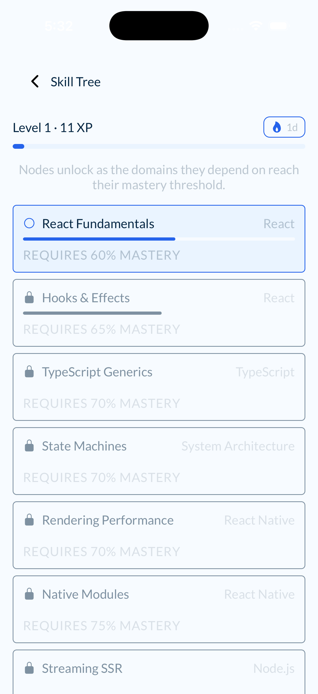

<p align="center">
  
  
  
</p>

# Expo Boilerplate v0.0.6 — Simple & Friendly by [BinniCordova.com](https://binnicordova.com) [LinkedIn](https://www.linkedin.com/in/binnicordova)

I've crafted this boilerplate using my 8+ years of experience as an Expo developer. It's a short, easy-to-understand starter for building mobile apps with Expo + React Native. Version **v0.0.6** now includes built-in **AI Agent Skills** I've designed to accelerate your development, control AI generation for higher quality output, and enforce clean code standards automatically. 

**Who is this for?**
- Product people and designers who want a quick overview.
- Developers who need a ready-to-use project with AI-superpowers.

## Quick start

1. Prerequisites:
- **Bun**: v1.1 or newer (Our recommended and favorite manager)
- **Node.js**: v20 or newer (LTS recommended)

1. Create your new app from my template (keeps `.github`, removes git history):

```sh
git clone --depth 1 https://github.com/binnicordova/expo-boilerplate.git my-app && cd my-app && rm -rf .git && git init
```

> This is the recommended way for this repository template: you keep my AI Skills, prompts, and instruction files, and start your own fresh git repository with no previous commits.

If you use `create-expo --template`, some template files (including AI setup under `.github`) can be skipped:

```sh
bunx create-expo --template https://github.com/binnicordova/expo-boilerplate
```
or use pnpx, npx, yarn...

2. Install dependencies:

```sh
bun install
```

3. Run and preview on your iPhone or Android device (scan the QR in Expo Go):

```sh
bun start
```
Download [Expo Go Android](https://play.google.com/store/apps/details?id=host.exp.exponent&hl=en_US) or
[Expo Go iPhone](https://apps.apple.com/us/app/expo-go/id982107779)

4. Optionally, launch on devices or emulators from the terminal:
- Press **i** to open on iOS simulator.
- Press **a** to open on Android emulator.
- Press **w** to open on web browser.

## TV Support (Apple TV & Android TV)

I've made this boilerplate safe for TV devices at runtime (notifications and background tasks are disabled). It supports:
- **Apple TV** (tvOS)
- **Android TV** and **Google TV**
- Compatible devices like **Fire TV**, **Nvidia Shield**, and **Chromecast with Google TV**, **Watch Onn TV**.

- Expo Go does not run on TV devices.
- Use a Development Build for TV testing.
- Keep using the same codebase for iOS, Android, Web, and TV.

Recommended TV flow:

```sh
bun install
bun ios # or bun android
```

Then select your TV simulator or device from your native tooling.

## Helpful commands

- **Preview on a device**: `bun run eas-preview`
- **Run component stories**: `bun run storybook:start`
- **Browse stories on the web**: `bun run storybook:web` 🌐
- **Run tests**: `bun run test`

## Where to look in my code (Project Structure)

My project follows a **SCREAMING ARCHITECTURE**, where the folder structure clearly communicates the intent and domain of the application rather than just technical details. It includes:

- 📂 **Main code**: `src/`
- 📱 **App screens**: `src/app/` (Expo Router file-based routing)
- 🧩 **Shared components**: `src/components/` (Follows **ATOMIC DESIGN** methodology)
- 📦 **State management**: `src/stores/` (Global state using Jotai)
- 🎣 **Hooks**: `src/hooks/` (Custom React hooks)
- 🎨 **Theme & Styles**: `src/theme/` and `src/styles/` (Design tokens and global styles)
- 🛠️ **Utils**: `src/utils/` (Helper functions)
- 🌍 **Translations**: `src/i18n/` (English + Spanish catalogues and the typed translator)

## Technical Stack Details (Architecture)

I've built this project with a modern and robust stack:

- **Framework**: Expo / React Native
- **Language**: TypeScript
- **Navigation**: Expo Router (File-based routing)
- **State Management**: Jotai (Atomic state)
- **Styling**: Styled Components / StyleSheet
- **Design Pattern**: Atomic Design for components (Atoms, Molecules, Organisms)
- **Internationalisation**: i18next + react-i18next + expo-localization (follows the device language, falls back to English, overridable in-app)
- **Testing**: Jest

## Deployment (AppStore / PlayStore / Web)

When you’re ready to publish, use **EAS (Expo Application Services)**:

**Build for Production:**
```sh
bun run build:prod
```

**Update over the Air (OTA):**
```sh
bun run update:prod
```

## Reset Project & Tools

**Reset the Project:**
To reset the project and remove all example code, run the following command:
```sh
bun run reset-project
```

**Generate Branding Assets:**
To generate all required app icons and store assets, simply provide a square `logo.png` or `logo.svg` (recommend 1024x1024) in the `scripts/` folder and run:
```sh
bun run generate:branding
```
This script asks you the image path, and automatically populates all different required sizes and splashes for Expo and the App/Play Stores.

## 🤖 AI Agent Skills & Automation

This boilerplate is uniquely optimized for **Agentic Workflows**. I've included **Specialized Agent Skills** (located in `.github/skills/`) that transform your AI assistant (Copilot, Cursor, etc.) from a simple completion tool into a domain expert that knows how to:

- 🚀 **Accelerate Development**: Use Context-Augmented Generation (RAG) to implement features based on this project's specific modular patterns.
- 🎯 **Enforce Standards**: Prevent the AI from hallucinating or using outdated libraries by anchoring it to our technical stack (Jotai, Expo Router, Biome).
- 🧹 **Automate Quality**: Handle repetitive tasks like unit test generation and README documentation via specialized prompt engineering.
- ⏱️ **Zero Research**: Eliminate the need for the AI to "guess" folder locations or configuration details.

### Cross-AI Compatibility
My Agent Skills and Prompts are precision-engineered for:
- ✅ **GitHub Copilot** (Optimized for `@workspace` and `#file` references)
- ✅ **Cursor** (Deep integration with `.cursorrules` and Composer)
- ✅ **Claude Dev / Roo Code** (High-autonomy agentic prompts)
- ✅ **Open Claude** (System-level instructions for zero-shot quality)
- ✅ **Windsurf** (Flow-based AI orchestration)

### How to use AI
You can manually trigger these AI powerups by typing "#" and selecting the prompt or skill. 

> **Pro Tip**: In advanced agents (like GitHub Copilot or Cursor), these skills are often **triggered automatically**. The agent scans your workspace, detects these instruction files, and applies them to its context window before you even ask.

```
#expo-architect       - Design modular systems using Screaming Architecture
#building-ui          - Create pixel-perfect Native UI with Atomic Design
#api-routes           - Build scalable Serverless API handlers
#deployment           - Orchestrate App Store & Play Store submissions
#upgrading-expo       - Handle SDK migrations and dependency conflict resolution
```

**Automation Prompts:**
```
#EXPO-RELEASE-NEXT-VERSION.prompt.md  - Automate versioning and changelogs
#EXPO-TEST-CREATE.prompt.md           - Generate 100% coverage unit tests
#EXPO-DOC-README-CREATE.prompt        - Self-documenting codebase updates
#CREATE-PR.prompt.md                  - Generate professional PR descriptions
```

## How to create a new APP product, by Binni Cordova

I leverage a high-velocity AI workflow to transform concepts into scaled products in record time:

1. **Strategic Discovery with AI**: I start by using AI (Gemini/ChatGPT/DeepSeek) to analyze the business concept and refine the Requirements. I research potential competitors to identify market gaps and define the "Unfair Advantage" I will build into my code.
2. **AI-First Design**: I utilize [**STICH Google AI**](https://stitch.withgoogle.com) (Gemma/Gemini) to generate high-fidelity design strategies. I don't just ask for "a UI"—I ask for a design system that works with Expo's primitives.
3. **Agentic Scaffolding**: I use **GitHub Copilot** or **Cursor** to modify this boilerplate. I ALWAYS anchor the session to my custom **Agent Skills** (like `#expo-architect`) to ensure every line of code generated follows the **Screaming Architecture** and **Atomic Design** principles from day one, based on the generated AI design.
4. **Res resilient Modeling**: Before writing UI, I define my data models and Jotai atoms. I use the AI to generate the `src/models/` and `src/stores/` layers, creating a type-safe foundation for the entire app.
5. **Continuous CI/CD (EAS)**: I generate builds using **EAS**. I use `bun run build:prod` to push to the cloud, letting the CI handle the heavy lifting while I continue developing.
6. **The "No-Wait" Release (OTA)**: Traditional store reviews kill momentum. I bypass them for UI tweaks and logic fixes using **Over-the-Air (OTA)** updates via `bun run update:prod`, pushing changes directly to users in seconds.
7. **KPI-Driven Iteration**: I monitor analytics and use AI to transform raw user data into actionable feature requests or bug fixes, maintaining a constant state of improvement.

## 🚀 What you can build with this Boilerplate

I designed this architecture to be versatile enough to power the next generation of high-growth startups. Here are some ideal use cases:

- **AI-Native SaaS**:
  - *Examples*: "Chat with your Data" apps, Personal AI Agents, Automated Content Generators, AI Writing Assistants, Intelligent Research Tools, Coding Copilots, AI Image Editors.
- **Fintech & Digital Wallets**:
  - *Examples*: Neobanks, Crypto Wallets, Expense Trackers, Portfolio Managers, Split-Bill Apps, Micro-Lending Platforms, Payroll Management, Stock/Forex Analyzers.
- **On-Demand Marketplaces**:
  - *Examples*: Food/Grocery Delivery, Professional Service Platforms (Handymen, Cleaners), Ride-Sharing, Real-Time Peer-to-Peer Rentals, Freelance Talent Hubs.
- **Healthcare & Wellness**:
  - *Examples*: Patient Portals, Medication Reminders, Fitness Trackers, Meditation Apps, Mental Health Journals, Telemedicine Platforms, Nutrition & Macro Trackers.
- **Smart Home (IoT)**:
  - *Examples*: Smart Lighting Controllers, Home Security Dashboards, Energy Consumption Monitors, Appliance Hubs, Garden Automation Systems.
- **EdTech Platforms**:
  - *Examples*: Language Learning Apps, Skill-Based Video Courses, Interactive Flashcards, Student Management Systems, Test Preparation Hubs, Coding Bootcamps.
- **Enterprise Companion Apps**:
  - *Examples*: Field Service CRM, Inventory Managers, Internal Employee Portals, Warehouse Logistics Trackers, Sales Enablement Tools, Task Management for Teams.
- **Travel & Real Estate**:
  - *Examples*: Itinerary Planners, Property Search & Virtual Tours, Booking Engines, Local Discovery Guides, House Hunting Checklists.
- **E-commerce & Social**:
  - *Examples*: Boutique Shopping Apps, Community Discussion Boards, Interest-Based Social Networks, Event Planning Hubs, Membership Clubs.

## 📬 Connect with Binni Cordova

PortFolio
- [BinniCordova.com](https://binnicordova.com)

Feel free to reach out if you have any questions or need support. Call [ +1 (650) 374-4225 ](tel:+16503744225) and ask for Binni Cordova.

Contact me:
- [](https://www.linkedin.com/in/binnicordova)
- [](https://calendly.com/binnizenobiocordovaleandro/meet)
- [](https://github.com/binnizenobiocordovaleandro)
- [](mailto:binnizenobiocordovaleandro@gmail.com)
- [](tel:+1-650-374-4225)

